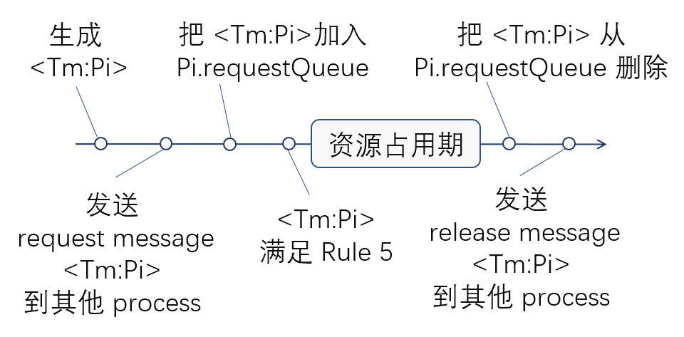

# Mutual Exclusion Algorithm Demo

使用 Go 语言实现了 Lamport 在论文 [《Time, Clocks and the Ordering of Events in a Distributed System》](time-clocks.pdf)中提到的 Mutual Exclusion 算法。

## 问题

多个 process 组成分享同一个 resource，但 resource 最多只能被一个 process 占用。由于 process 是分布式的，只能通过各自的 clock 读取时间值，这些 clock 的时间值不一定同步，没有办法通过时间上的编排来分别占用 resource。需要靠算法满足以下要求：

1. 对于 resource，一定要先释放，再占用。
1. 对于 process， 先申请，先占用。
1. 如果 process 占用 resource 的时间有限，那么，所有占用 resource 的申请，都会被满足。

为了简化问题，还存在以下假设：

1. 任意两个 process 都可以直接相互发送消息
1. 对于任意两个 process Pi 和 Pj 而言，从 Pi 发往 Pj 的消息，满足先发送先到达的原则
1. process 间发送的消息，一定会收到

## 从局部排序到全局排序

在展开之前，先强调几个定义：

1. 多个 process 中第 i 个 process 标记为 Pi
1. process 由一系列 event 组成，第 j 个 event 标记为 Ej
1. 每个 process 都有一个 clock 用于标记 event 发生的时间。第 i 个 process 发生第 j 个 event 的时间，标记为 Ci(Ej)
1. 每个 process 都是 **串行** 的
1. process 之间可以通过 send 和 receive message 来直接通信。send 和 receive 是两个 process 的单独事件。

### "happened before"

"happened before" 表示一个局部排序关系，有两种情况下成立

1. 串行的 Pm 中， Ei 比 Ej 早发生。 Ei "happened before" Ej，所以有 Cm(Ei) < Cm(Ej)。
1. 从 Pm 发送到 Pn 中的消息 message，Pm 中 Ei 是发送 message， Pn 中 Ej 是接受 message。Ei "happened before" Ej，所以有 Cm(Ei) < Cn(Ej)

以上两条，在论文中被称为 `Clock Condition`。

### Lamport timestamps

为了让 system 中的 clocks 满足 `Clock Condition`，论文上的规定了 IR1 和 IR2，并在最后演变成了 [Lamport timestamps](https://en.wikipedia.org/wiki/Lamport_timestamps) 规则：

1. 进程在每做一件事情之前，计数器+1
1. 当进程发送消息的时候，需要带上计数器的值
1. 当进程接收消息的时候，需要根据消息中的值，更新自己的计数器。更新规则为 max(自身值，消息值)+1

以下是规则的伪代码

```code
// 在进程内
time_stamp = time_stamp + 1
doOneEvent()

// 进程发现消息时
time = time + 1
time_stamp = time
send(message, time_stamp)

// 进程接收消息时
(message, time_stamp) = receive()
time = max(time_stamp, time) + 1
```

> 基维百科上的说法和论文的说法，略有不同。我的代码以论文为准。

### 全局排序

`Ei => Ej` 表示，在全局排序中， Ei 排在 Ej 前面。

对于 system 中的任意一个 event，可以使用其所在的 process P 和发生的 timestamp T 进行编号为： `<T:P>`。

任意两个事件 Ei`<Tm:Pa>` 和 Ej`<Tn:Pb>`， 若要使得 `Ei => Ej` 成立，需要以下两个条件之一成立：

1. Tm < Tn
1. Tm == Tn 且 Pa < Pb

其中 Pa < Pb 的含义是， system 中 process 中也存在一种排序方式。我在代码中选择使用 process 的代号，对其进行排序。

## mutual exclusion 算法

mutual exclusion 算法需要每个 process 维护自己的 request queue。 由 5 个规则组成

1. 为了申请 resource，process Pi 需要
    1. 生成 request `<Tm:Pi>`
    1. 发送 request message `<Tm:Pi>` 到所有其他的 process
    1. 把 `<Tm:Pi>` 放入自己的 request queue
1. 当 Pj 收到 request message `<Tm:Pi>` 后
    1. 把 `<Tm:Pi>` 放入自己的 request queue
    1. 回复 Pi 一条 acknowledge message，确认收到。
1. 为了释放 resource，process Pi 需要
    1. 释放 resource
    1. 把 `<Tm:Pi>` 移出自己的 request queue
    1. 发送 release message `<Tm:Pi>` 到所有其他的 process
1. 当 Pj 收到 release message `<Tm:Pi>` 后
    1. 把 `<Tm:Pi>` 移出自己的 request queue
1. 当以下全部条件满足时，Pi 可以占用 resource：
    1. 在 Pi 的 request queue 中，`<Tm:Pi>` 与其他 event 都是 `=>` 关系。
    1. Pi 收到所有其他 process 消息的最新时间中的最小值 > Tm

每个 process 只需要独立平等地处理这 5 种 event，就可以避免 process 同时占用 resource 的情况。

以上 5 个规则，是从 process 之间交互的角度来规定的。如果把 request `<Tm:Pi>` 的整个生命周期放在 Pi 的时间轴上。如下图所示



从图中可以看到

1. 资源占用期两边是 `<Tm:Pi>` 加入和退出 Pi.requestQueue
1. 操作 Pi.requestQueue 的两边是，给其他 process 发送消息的时间

这个顺序很重要，因为这个顺序保证了 `<Tm:Pi>` 在 Pi 中满足 Rule5 的时候，`<Tm:Pi>` 在所有的 process 的 request queue 中都是全局排序排在最前面的。所以 Pi 才能大胆地占用 resource，而不担心重复。

## 总结

由 lamport timestamps 规则和 process 排序，可以得到 system 内所有 event 的一种全局排序。request event 是全部 event 的子集，因此也可以全局排序。resource 占用顺序与其排序顺序一致。因此 mutual exclusion 算法能够满足要求。

## 思考问题

1. 为什么会出现多种全局排序？请举例说明。
1. 真实时间上先 request 的 process 会不会后得到 resource？如果会的话，能不能说明 mutual exclusion 算法失败了？请说明理由。

[参考答案](qna.md)
